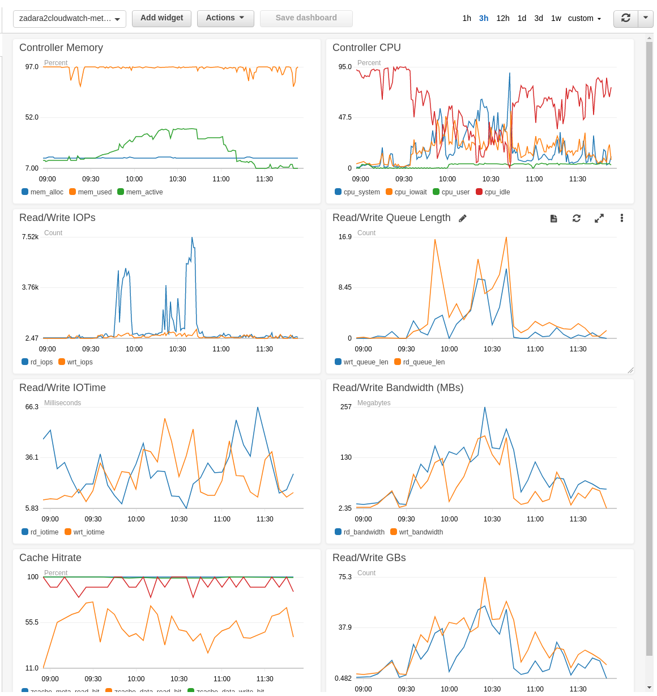

## zadara2cloudwatch

Push Zadara metrics and logs to cloudwatch. Metric data and logs are retrieved from
Zadara via their [REST API](http://vpsa-api.zadarastorage.com/).

`zadara2cloudwatch` builds a CloudFormation stack with the following resources:

* AWS::Lambda::Function - fetches metrics and logs and pushes to cloudwatch
* AWS::IAM::Role - service role assumed by the function
* AWS::Event::Rule - scheduled function trigger
* AWS::Lambda::Permission - gives the event permission to trigger lambda
* AWS::Logs::LogGroup/LogStream - log group/stream for receiving log events

The Lambda function is triggered every 5 minutes. It fetches the most recent metrics for 
pools, volumes, servers (active) and controllers, as well as vpsa cache performance and
stats. It also fetches the most recent VPSA log events, keeping track of the last
event received via an SSM parameter.

This project was created by and for Harvard DCE, and might not be sufficient to 
satisfy all needs, but the function code is very straightforward and could be 
extended to include more data. Fork or pull request!


## Setup

The project requires python 3 and was built/tested using v3.6.x.

After cloning the repo and activating a virtualenv, install the development
dependencies by running:

`pip install -r requirements_dev.txt`

To see a list of commands, run:

`invoke -l`

```bash
Available tasks:

  create-dashboard   Create a CloudWatch dashboard as defined by cw_dashboard.json. You must provide the name of a controller, volume & pool present in the
                     cloudwatch metric dimensions.
  delete             Delete the CloudFormation stack
  deploy             Create or update the CloudFormation stack. Note: you must run `package` first.
  package            Package the function + dependencies into a zipfile and upload to s3 bucket created via `create-code-bucket`
  update-function    Update the function code with the latest packaged zipfile in s3. Note: this will publish a new Lambda version.

```

#### Create a `.env` file

Copy `example.env` to `.env` in the project directory and fill in the necessary values:

`AWS_PROFILE` - this is only necessary if you have multiple aws profiles configured in `~/.aws/credentials`

`LAMBDA_CODE_BUCKET` - name of an s3 bucket for storing the packaged lambda function code. The uploaded {{.zip}} file object will have a key like `z2cw/${STACK_NAME}.zip`.

`STACK_NAME` - name of the CloudFormation stack that will be created. The names of many of the stack's resources are also based on this value, e.g. the lambda function will be named `${STACK_NAME}-function`

`API_KEY` - your Zadara API key value

`VPSA_HOST` - the host value of your Zadara VPSA, e.g. "vsa-0000099z-aws2.zadaravpsa.com:443"

`METRIC_INTERVAL` - Interval (in seconds) between metric datapoints pulled from the Zadara API

`METRIC_NAMESPACE` - CloudWatch metric namespace the metric data will be pushed to

`VPC_SUBNET_ID` - ID of a VPC subnet that has access to the Zadara VPSA. This is necessary for the Lambda function to be able to communicate with the VPSA. (In the case of our DCE Opencast clusters, this should be the "private subnet".)

`VPC_SECURITY_GROUP_ID` - Security Group ID in the VPC. (For DCE this is the "Common" security group.)

#### Initialize the stack

Run the following commands:

1. `invoke package`
1. `invoke deploy`

Wait for the CloudFormation console to show `CREATE_COMPLETE` for the stack.

#### Additional commands

Once the Zadara metrics begin to appear (should take ~5m for first trigger event), view the metrics and copy the name of the controller and volume. Use those values to create the default Cloudwatch dashboard:

`invoke create-dashboard [controller-id] [volume-id] [pool-id]`

To publish an updated version of the lambda function code run:

`invoke update-function`

To delete the Cloudformation stack run:

`invoke delete`

#### Dashboard screenshot


